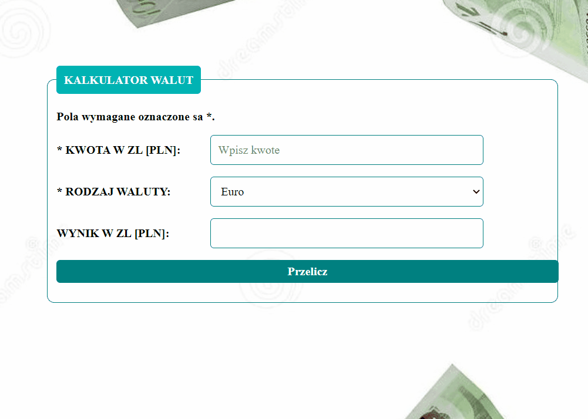

# Currency-Converter
Hello, it is my second website. 
My currency converter is simple but I used Markdown and OpenGRaph, Flex and JS Funktion.
I hope that you can see my progress. 

# Demo
https://maram-9.github.io/Currency-converter/

## Available currencies:
- PLN
- EURO
- USD
- GBP
- CHF

## Languages and conventions used in the project:
- HTML
- JS
- CSS
- BEM
